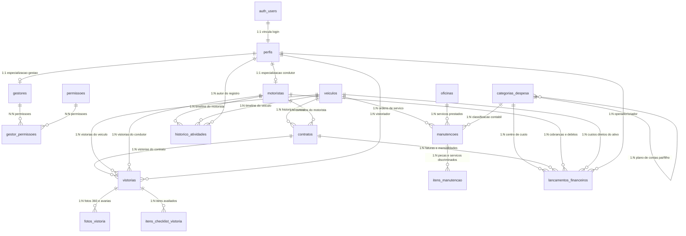

# 🏛️ Plano de Arquitetura e Modelagem Relacional — Supabase (PostgreSQL)

> **Backend Oficial Exclusivo:** `Supabase (PostgreSQL 15+ Relacional + Auth + Storage + Realtime)`  
> **Projeto Supabase Ativo:** `Gestaodefrota`  
> **Project Reference ID:** `rwksrejrmjqnuspqnokp`  
> **Região:** `South America (São Paulo) - sa-east-1`  
> **Padrão de Nomenclatura:** Tabelas, colunas, enums, views e funções em **Português** (`snake_case`)  
> **Paradigma:** Banco de Dados Relacional Normalizado (3FN), Integridade Referencial Forte, Transações ACID e Triggers PL/pgSQL  
> **Integração MCP:** Ativa via [`.agents/mcp_config.json`](file:///c:/gestaodefrota/.agents/mcp_config.json)

---

## 🎯 1. Visão Geral e Princípios da Arquitetura Relacional

O backend do sistema de Gestão de Frota é construído estritamente sobre os fundamentos de um **SGBD Relacional (PostgreSQL no Supabase)**, priorizando:

1. **Normalização em 3ª Forma Normal (3FN):** Eliminação de redundâncias e de campos genéricos semi-estruturados (`JSONB`). Todas as entidades dependentes (como fotos de vistorias, itens de checklist, peças de manutenção e permissões de acesso) são modeladas como **tabelas relacionais filhas ou associativas (N:N)**.
2. **Integridade Referencial Forte:** Definição explícita de chaves estrangeiras (`FOREIGN KEY`) com regras de restrição e deleção consistentes (`ON DELETE RESTRICT`, `ON DELETE CASCADE`, `ON DELETE SET NULL`).
3. **Restrições de Domínio (CHECK & UNIQUE):** Regras de validação em nível de tabela que garantem a sanidade dos dados diretamente no motor do banco (ex: odômetro >= 0, valores monetários positivos, placa no padrão correto).
4. **Desempenho em Consultas com JOINs:** Criação de índices B-Tree em todas as chaves estrangeiras e colunas de filtragem frequente para garantir alta performance sem Table Scans.
5. **Automação por Triggers PL/pgSQL:** Garantia de consistência de estado automatizada no banco (atualização de status do veículo ao vincular contrato ou manutenção, atualização de KM atual via vistoria, recálculo de saldos financeiros).
6. **Transações Atômicas (ACID) via RPCs:** Operações compostas que envolvem múltiplas tabelas (ex: criação de contrato + geração de faturas de caução/aluguel + alteração de status do veículo) encapsuladas em funções SQL transacionais.
7. **Segurança Multinível (RBAC & RLS):** Políticas de Row Level Security vinculadas a subqueries relacionais que garantem o isolamento estrito dos dados por perfil (`admin`, `gestor`, `motorista`).

---

## 📐 2. Diagrama Entidade-Relacionamento (ERD)



---

## 🗄️ 3. Mapeamento das Tabelas e Schema Relacional Normalizado

### 3.1. Tipos ENUM do PostgreSQL
```sql
CREATE TYPE tipo_perfil_enum AS ENUM ('admin', 'gestor', 'motorista');
CREATE TYPE status_motorista_enum AS ENUM ('pendente_aprovacao', 'ativo', 'bloqueado', 'inativo');
CREATE TYPE status_veiculo_enum AS ENUM ('disponivel', 'alugado', 'manutencao', 'inativo', 'vendido');
CREATE TYPE status_ipva_enum AS ENUM ('pago', 'pendente', 'atrasado', 'isento');
CREATE TYPE status_contrato_enum AS ENUM ('ativo', 'concluido', 'cancelado', 'inadimplente');
CREATE TYPE frequencia_cobranca_enum AS ENUM ('semanal', 'quinzenal', 'mensal');
CREATE TYPE tipo_vistoria_enum AS ENUM ('check_in', 'check_out', 'rotina');
CREATE TYPE status_vistoria_enum AS ENUM ('pendente_revisao', 'aprovado', 'rejeitado');
CREATE TYPE tipo_foto_vistoria_enum AS ENUM ('frente', 'traseira', 'lateral_esquerda', 'lateral_direita', 'painel', 'hodometro', 'bancos', 'avaria', 'outro');
CREATE TYPE tipo_categoria_enum AS ENUM ('receita', 'despesa');
CREATE TYPE tipo_lancamento_enum AS ENUM ('receita', 'despesa');
CREATE TYPE status_financeiro_enum AS ENUM ('pendente', 'pago', 'atrasado', 'cancelado');
CREATE TYPE metodo_pagamento_enum AS ENUM ('pix', 'boleto', 'transferencia', 'dinheiro', 'cartao_credito');
CREATE TYPE status_oficina_enum AS ENUM ('ativo', 'suspenso', 'inativo');
CREATE TYPE tipo_manutencao_enum AS ENUM ('preventiva', 'corretiva', 'revisao_geral', 'funilaria', 'pneus', 'eletrica', 'outro');
CREATE TYPE status_manutencao_enum AS ENUM ('agendado', 'em_andamento', 'concluido', 'cancelado');
CREATE TYPE tipo_chave_pix_enum AS ENUM ('cpf', 'cnpj', 'email', 'telefone', 'aleatoria');
```

---

### 3.2. Módulo de Identidade, Perfis & RBAC Relacional

#### 🏢 `public.perfis`
Extensão relacional direta 1:1 de `auth.users`.
* `id` (UUID, PK, `REFERENCES auth.users(id) ON DELETE CASCADE`)
* `nome` (VARCHAR(150) NOT NULL)
* `email` (VARCHAR(150) UNIQUE NOT NULL)
* `telefone` (VARCHAR(20))
* `foto_url` (TEXT)
* `cargo` (`tipo_perfil_enum` NOT NULL DEFAULT 'motorista')
* `criado_em` (TIMESTAMPTZ NOT NULL DEFAULT now())
* `atualizado_em` (TIMESTAMPTZ NOT NULL DEFAULT now())

#### 🚗 `public.motoristas`
Especialização 1:1 de `perfis` para condutores da frota.
* `id` (UUID, PK, `REFERENCES public.perfis(id) ON DELETE CASCADE`)
* `cpf` (VARCHAR(14) UNIQUE NOT NULL)
* `numero_cnh` (VARCHAR(20) UNIQUE NOT NULL)
* `categoria_cnh` (VARCHAR(5) NOT NULL)
* `validade_cnh` (DATE NOT NULL)
* `cnh_frente_url` (TEXT)
* `cnh_verso_url` (TEXT)
* `comprovante_residencia_url` (TEXT)
* `logradouro` (VARCHAR(150))
* `numero` (VARCHAR(20))
* `complemento` (VARCHAR(50))
* `bairro` (VARCHAR(100))
* `cidade` (VARCHAR(100))
* `estado` (VARCHAR(2))
* `cep` (VARCHAR(10))
* `status` (`status_motorista_enum` NOT NULL DEFAULT 'pendente_aprovacao')
* `pontuacao_confianca` (INT NOT NULL DEFAULT 100 CHECK (pontuacao_confianca BETWEEN 0 AND 100))
* `valor_total_gerado` (NUMERIC(12,2) NOT NULL DEFAULT 0.00 CHECK (valor_total_gerado >= 0))
* `saldo_devedor` (NUMERIC(12,2) NOT NULL DEFAULT 0.00 CHECK (saldo_devedor >= 0))
* `criado_em` (TIMESTAMPTZ NOT NULL DEFAULT now())
* `atualizado_em` (TIMESTAMPTZ NOT NULL DEFAULT now())

#### 👔 `public.gestores`
Especialização 1:1 de `perfis` para operadores e gestores administrativos.
* `id` (UUID, PK, `REFERENCES public.perfis(id) ON DELETE CASCADE`)
* `salario_base` (NUMERIC(10,2) NOT NULL DEFAULT 0.00 CHECK (salario_base >= 0))
* `percentual_comissao` (NUMERIC(5,2) NOT NULL DEFAULT 0.00 CHECK (percentual_comissao BETWEEN 0 AND 100))
* `ativo` (BOOLEAN NOT NULL DEFAULT TRUE)
* `criado_em` (TIMESTAMPTZ NOT NULL DEFAULT now())
* `atualizado_em` (TIMESTAMPTZ NOT NULL DEFAULT now())

#### 🔑 `public.permissoes`
Catálogo relacional de permissões do sistema.
* `id` (UUID, PK DEFAULT gen_random_uuid())
* `codigo` (VARCHAR(50) UNIQUE NOT NULL) — ex: `'frota.criar'`, `'financeiro.baixar'`
* `nome` (VARCHAR(100) NOT NULL)
* `modulo` (VARCHAR(50) NOT NULL)
* `descricao` (TEXT)

#### 🔗 `public.gestor_permissoes`
Tabela associativa N:N entre gestores e permissões granulares.
* `gestor_id` (UUID NOT NULL, `REFERENCES public.gestores(id) ON DELETE CASCADE`)
* `permissao_id` (UUID NOT NULL, `REFERENCES public.permissoes(id) ON DELETE CASCADE`)
* `concedido_em` (TIMESTAMPTZ NOT NULL DEFAULT now())
* **PK Composta:** `(gestor_id, permissao_id)`

---

### 3.3. Módulo de Frota & Ativos (`public.veiculos`)

Armazena os veículos, especificações técnicas, documentação, seguro e financiamento.
* `id` (UUID, PK DEFAULT gen_random_uuid())
* `placa` (VARCHAR(10) UNIQUE NOT NULL)
* `marca` (VARCHAR(50) NOT NULL)
* `modelo` (VARCHAR(80) NOT NULL)
* `ano_fabricacao` (INT NOT NULL CHECK (ano_fabricacao >= 1990))
* `ano_modelo` (INT NOT NULL CHECK (ano_modelo >= ano_fabricacao))
* `cor` (VARCHAR(30) NOT NULL)
* `renavam` (VARCHAR(30) UNIQUE)
* `chassi` (VARCHAR(30) UNIQUE)
* `km_atual` (INT NOT NULL DEFAULT 0 CHECK (km_atual >= 0))
* `status` (`status_veiculo_enum` NOT NULL DEFAULT 'disponivel')
* `crlv_url` (TEXT)
* `numero_apolice_seguro` (VARCHAR(100))
* `seguradora` (VARCHAR(100))
* `vencimento_seguro` (DATE)
* `status_ipva` (`status_ipva_enum` NOT NULL DEFAULT 'pendente')
* `valor_ipva` (NUMERIC(10,2) CHECK (valor_ipva >= 0))
* `vencimento_ipva` (DATE)
* `financiamento_total_parcelas` (INT DEFAULT 0 CHECK (financiamento_total_parcelas >= 0))
* `financiamento_parcelas_pagas` (INT DEFAULT 0 CHECK (financiamento_parcelas_pagas >= 0))
* `financiamento_valor_parcela` (NUMERIC(10,2) DEFAULT 0.00 CHECK (financiamento_valor_parcela >= 0))
* `criado_em` (TIMESTAMPTZ NOT NULL DEFAULT now())
* `atualizado_em` (TIMESTAMPTZ NOT NULL DEFAULT now())
* **Constraint:** `CHECK (financiamento_parcelas_pagas <= financiamento_total_parcelas)`

---

### 3.4. Módulo de Contratos de Locação (`public.contratos`)

Entidade relacional central que vincula o Veículo e o Motorista ao longo do tempo.
* `id` (UUID, PK DEFAULT gen_random_uuid())
* `numero_contrato` (VARCHAR(50) UNIQUE NOT NULL)
* `motorista_id` (UUID NOT NULL, `REFERENCES public.motoristas(id) ON DELETE RESTRICT`)
* `veiculo_id` (UUID NOT NULL, `REFERENCES public.veiculos(id) ON DELETE RESTRICT`)
* `data_inicio` (DATE NOT NULL)
* `data_fim` (DATE)
* `valor_locacao` (NUMERIC(10,2) NOT NULL CHECK (valor_locacao > 0))
* `valor_caucao` (NUMERIC(10,2) NOT NULL DEFAULT 0.00 CHECK (valor_caucao >= 0))
* `frequencia_cobranca` (`frequencia_cobranca_enum` NOT NULL DEFAULT 'semanal')
* `dia_vencimento` (INT NOT NULL CHECK (dia_vencimento BETWEEN 1 AND 31))
* `status` (`status_contrato_enum` NOT NULL DEFAULT 'ativo')
* `assinatura_digital_url` (TEXT)
* `assinado_em` (TIMESTAMPTZ)
* `criado_em` (TIMESTAMPTZ NOT NULL DEFAULT now())
* `atualizado_em` (TIMESTAMPTZ NOT NULL DEFAULT now())
* **Constraint:** `CHECK (data_fim IS NULL OR data_fim >= data_inicio)`

---

### 3.5. Módulo de Vistorias e Check-ins Relacional

#### 📋 `public.vistorias`
Registro mestre de vistoria com integridade para contrato, veículo e participantes.
* `id` (UUID, PK DEFAULT gen_random_uuid())
* `contrato_id` (UUID NOT NULL, `REFERENCES public.contratos(id) ON DELETE RESTRICT`)
* `veiculo_id` (UUID NOT NULL, `REFERENCES public.veiculos(id) ON DELETE RESTRICT`)
* `motorista_id` (UUID NOT NULL, `REFERENCES public.motoristas(id) ON DELETE RESTRICT`)
* `vistoriador_id` (UUID, `REFERENCES public.perfis(id) ON DELETE SET NULL`)
* `tipo` (`tipo_vistoria_enum` NOT NULL)
* `odometro_km` (INT NOT NULL CHECK (odometro_km >= 0))
* `nivel_combustivel` (NUMERIC(3,2) NOT NULL CHECK (nivel_combustivel BETWEEN 0.00 AND 1.00))
* `tem_avaria_nova` (BOOLEAN NOT NULL DEFAULT FALSE)
* `status` (`status_vistoria_enum` NOT NULL DEFAULT 'pendente_revisao')
* `motivo_revisao` (TEXT)
* `observacoes` (TEXT)
* `criado_em` (TIMESTAMPTZ NOT NULL DEFAULT now())

#### 📸 `public.fotos_vistoria` (Filha 1:N de `vistorias`)
Substitui campos monolíticos de fotos por registros relacionais tipados.
* `id` (UUID, PK DEFAULT gen_random_uuid())
* `vistoria_id` (UUID NOT NULL, `REFERENCES public.vistorias(id) ON DELETE CASCADE`)
* `tipo_foto` (`tipo_foto_vistoria_enum` NOT NULL)
* `url_foto` (TEXT NOT NULL)
* `tem_avaria` (BOOLEAN NOT NULL DEFAULT FALSE)
* `descricao_avaria` (TEXT)
* `criado_em` (TIMESTAMPTZ NOT NULL DEFAULT now())

#### ✔️ `public.itens_checklist_vistoria` (Filha 1:N de `vistorias`)
Substitui arrays soltos por itens normalizados de checagem.
* `id` (UUID, PK DEFAULT gen_random_uuid())
* `vistoria_id` (UUID NOT NULL, `REFERENCES public.vistorias(id) ON DELETE CASCADE`)
* `item_nome` (VARCHAR(100) NOT NULL) — ex: `'Estepe e Macaco'`, `'Ar Condicionado'`
* `conforme` (BOOLEAN NOT NULL DEFAULT TRUE)
* `observacao` (TEXT)
* `criado_em` (TIMESTAMPTZ NOT NULL DEFAULT now())

---

### 3.6. Módulo de Oficinas, Manutenções & Peças Relacional

#### 🏢 `public.oficinas`
Cadastro das oficinas credenciadas com dados bancários normalizados.
* `id` (UUID, PK DEFAULT gen_random_uuid())
* `cnpj` (VARCHAR(18) UNIQUE NOT NULL)
* `nome_fantasia` (VARCHAR(150) NOT NULL)
* `razao_social` (VARCHAR(150))
* `telefone` (VARCHAR(20) NOT NULL)
* `email` (VARCHAR(100))
* `endereco` (TEXT)
* `banco_nome` (VARCHAR(80))
* `agencia` (VARCHAR(20))
* `conta_corrente` (VARCHAR(30))
* `tipo_chave_pix` (`tipo_chave_pix_enum`)
* `chave_pix` (VARCHAR(100))
* `avaliacao` (NUMERIC(2,1) NOT NULL DEFAULT 5.0 CHECK (avaliacao BETWEEN 1.0 AND 5.0))
* `status` (`status_oficina_enum` NOT NULL DEFAULT 'ativo')
* `criado_em` (TIMESTAMPTZ NOT NULL DEFAULT now())
* `atualizado_em` (TIMESTAMPTZ NOT NULL DEFAULT now())

#### 🔧 `public.manutencoes`
Registro das ordens de serviço e manutenções da frota.
* `id` (UUID, PK DEFAULT gen_random_uuid())
* `veiculo_id` (UUID NOT NULL, `REFERENCES public.veiculos(id) ON DELETE RESTRICT`)
* `oficina_id` (UUID NOT NULL, `REFERENCES public.oficinas(id) ON DELETE RESTRICT`)
* `categoria_id` (UUID NOT NULL, `REFERENCES public.categorias_despesa(id) ON DELETE RESTRICT`)
* `tipo_manutencao` (`tipo_manutencao_enum` NOT NULL DEFAULT 'preventiva')
* `descricao` (TEXT NOT NULL)
* `odometro_km` (INT NOT NULL CHECK (odometro_km >= 0))
* `data_servico` (DATE NOT NULL)
* `custo_mao_de_obra` (NUMERIC(10,2) NOT NULL DEFAULT 0.00 CHECK (custo_mao_de_obra >= 0))
* `custo_pecas` (NUMERIC(10,2) NOT NULL DEFAULT 0.00 CHECK (custo_pecas >= 0))
* `custo_total` (NUMERIC(10,2) NOT NULL CHECK (custo_total >= 0))
* `nota_fiscal_nfe_url` (TEXT)
* `comprovante_url` (TEXT)
* `status` (`status_manutencao_enum` NOT NULL DEFAULT 'agendado')
* `criado_em` (TIMESTAMPTZ NOT NULL DEFAULT now())
* `atualizado_em` (TIMESTAMPTZ NOT NULL DEFAULT now())
* **Constraint:** `CHECK (custo_total = (custo_mao_de_obra + custo_pecas))`

#### 🔩 `public.itens_manutencao` (Filha 1:N de `manutencoes`)
Tabela relacional de peças e serviços aplicados na ordem de serviço.
* `id` (UUID, PK DEFAULT gen_random_uuid())
* `manutencao_id` (UUID NOT NULL, `REFERENCES public.manutencoes(id) ON DELETE CASCADE`)
* `descricao_peca` (VARCHAR(150) NOT NULL)
* `quantidade` (INT NOT NULL DEFAULT 1 CHECK (quantidade > 0))
* `valor_unitario` (NUMERIC(10,2) NOT NULL CHECK (valor_unitario >= 0))
* `valor_total` (NUMERIC(10,2) GENERATED ALWAYS AS (quantidade * valor_unitario) STORED)
* `criado_em` (TIMESTAMPTZ NOT NULL DEFAULT now())

---

### 3.7. Módulo Financeiro & Plano de Contas Relacional

#### 🌳 `public.categorias_despesa`
Estrutura hierárquica em árvore para o plano de contas e centros de custo.
* `id` (UUID, PK DEFAULT gen_random_uuid())
* `categoria_pai_id` (UUID, `REFERENCES public.categorias_despesa(id) ON DELETE SET NULL`)
* `nome` (VARCHAR(100) NOT NULL)
* `tipo` (`tipo_categoria_enum` NOT NULL)
* `codigo_contabil` (VARCHAR(20))
* `ativo` (BOOLEAN NOT NULL DEFAULT TRUE)
* `criado_em` (TIMESTAMPTZ NOT NULL DEFAULT now())

#### 💰 `public.lancamentos_financeiros`
Livro-razão e controle de contas a pagar e receber.
* `id` (UUID, PK DEFAULT gen_random_uuid())
* `categoria_id` (UUID NOT NULL, `REFERENCES public.categorias_despesa(id) ON DELETE RESTRICT`)
* `contrato_id` (UUID, `REFERENCES public.contratos(id) ON DELETE SET NULL`)
* `motorista_id` (UUID, `REFERENCES public.motoristas(id) ON DELETE SET NULL`)
* `veiculo_id` (UUID, `REFERENCES public.veiculos(id) ON DELETE SET NULL`)
* `criado_por` (UUID, `REFERENCES public.perfis(id) ON DELETE SET NULL`)
* `tipo` (`tipo_lancamento_enum` NOT NULL)
* `titulo` (VARCHAR(150) NOT NULL)
* `descricao` (TEXT)
* `valor` (NUMERIC(12,2) NOT NULL CHECK (valor > 0))
* `data_vencimento` (DATE NOT NULL)
* `data_pagamento` (DATE)
* `status` (`status_financeiro_enum` NOT NULL DEFAULT 'pendente')
* `metodo_pagamento` (`metodo_pagamento_enum` NOT NULL DEFAULT 'pix')
* `pix_copia_cola` (TEXT)
* `pix_qr_code_url` (TEXT)
* `comprovante_url` (TEXT)
* `criado_em` (TIMESTAMPTZ NOT NULL DEFAULT now())
* `atualizado_em` (TIMESTAMPTZ NOT NULL DEFAULT now())
* **Constraint:** `CHECK (status != 'pago' OR data_pagamento IS NOT NULL)`

---

### 3.8. Histórico & Auditoria de Atividades (`public.historico_atividades`)

* `id` (UUID, PK DEFAULT gen_random_uuid())
* `motorista_id` (UUID, `REFERENCES public.motoristas(id) ON DELETE CASCADE`)
* `veiculo_id` (UUID, `REFERENCES public.veiculos(id) ON DELETE SET NULL`)
* `autor_id` (UUID, `REFERENCES public.perfis(id) ON DELETE SET NULL`)
* `tipo_evento` (VARCHAR(50) NOT NULL)
* `titulo` (VARCHAR(150) NOT NULL)
* `descricao` (TEXT)
* `criado_em` (TIMESTAMPTZ NOT NULL DEFAULT now())

---

## ⚡ 4. Índices Relacionais (Otimização de JOINs)

Para garantir que as consultas relacionais executem com complexidade **O(log N)** e sem Table Scans em tabelas volumosas:

```sql
-- Foreign Keys de Contratos
CREATE INDEX idx_contratos_motorista ON public.contratos(motorista_id);
CREATE INDEX idx_contratos_veiculo ON public.contratos(veiculo_id);
CREATE INDEX idx_contratos_status ON public.contratos(status);

-- Foreign Keys de Vistorias e Tabelas Filhas
CREATE INDEX idx_vistorias_contrato ON public.vistorias(contrato_id);
CREATE INDEX idx_vistorias_veiculo ON public.vistorias(veiculo_id);
CREATE INDEX idx_vistorias_motorista ON public.vistorias(motorista_id);
CREATE INDEX idx_fotos_vistoria_pai ON public.fotos_vistoria(vistoria_id);
CREATE INDEX idx_checklist_vistoria_pai ON public.itens_checklist_vistoria(vistoria_id);

-- Foreign Keys de Manutenções e Peças
CREATE INDEX idx_manutencoes_veiculo ON public.manutencoes(veiculo_id);
CREATE INDEX idx_manutencoes_oficina ON public.manutencoes(oficina_id);
CREATE INDEX idx_manutencoes_categoria ON public.manutencoes(categoria_id);
CREATE INDEX idx_itens_manutencao_pai ON public.itens_manutencao(manutencao_id);

-- Foreign Keys do Financeiro
CREATE INDEX idx_lancamentos_categoria ON public.lancamentos_financeiros(categoria_id);
CREATE INDEX idx_lancamentos_contrato ON public.lancamentos_financeiros(contrato_id);
CREATE INDEX idx_lancamentos_motorista ON public.lancamentos_financeiros(motorista_id);
CREATE INDEX idx_lancamentos_veiculo ON public.lancamentos_financeiros(veiculo_id);
CREATE INDEX idx_lancamentos_status_vencimento ON public.lancamentos_financeiros(status, data_vencimento);

-- RBAC
CREATE INDEX idx_gestor_permissoes_permissao ON public.gestor_permissoes(permissao_id);
```

---

## 🤖 5. Automação por Triggers & Funções PL/pgSQL

### 5.1. Sincronização de Odômetro do Veículo (`trg_atualizar_km_veiculo`)
Quando uma vistoria ou manutenção é registrada com quilometragem superior à atual do veículo, atualiza `veiculos.km_atual` automaticamente:
```sql
CREATE OR REPLACE FUNCTION public.fn_sincronizar_km_veiculo()
RETURNS TRIGGER AS $$
BEGIN
    UPDATE public.veiculos
    SET km_atual = GREATEST(km_atual, NEW.odometro_km),
        atualizado_em = now()
    WHERE id = NEW.veiculo_id;
    RETURN NEW;
END;
$$ LANGUAGE plpgsql SECURITY DEFINER;

CREATE TRIGGER trg_km_vistoria
AFTER INSERT ON public.vistorias
FOR EACH ROW EXECUTE FUNCTION public.fn_sincronizar_km_veiculo();

CREATE TRIGGER trg_km_manutencao
AFTER INSERT ON public.manutencoes
FOR EACH ROW EXECUTE FUNCTION public.fn_sincronizar_km_veiculo();
```

### 5.2. Sincronização de Status do Veículo com Contrato (`trg_sincronizar_status_veiculo_contrato`)
```sql
CREATE OR REPLACE FUNCTION public.fn_sincronizar_status_contrato()
RETURNS TRIGGER AS $$
BEGIN
    IF (TG_OP = 'INSERT' AND NEW.status = 'ativo') OR (TG_OP = 'UPDATE' AND NEW.status = 'ativo' AND OLD.status != 'ativo') THEN
        UPDATE public.veiculos SET status = 'alugado', atualizado_em = now() WHERE id = NEW.veiculo_id;
    ELSIF (TG_OP = 'UPDATE' AND NEW.status IN ('concluido', 'cancelado') AND OLD.status = 'ativo') THEN
        UPDATE public.veiculos SET status = 'disponivel', atualizado_em = now() WHERE id = NEW.veiculo_id;
    END IF;
    RETURN NEW;
END;
$$ LANGUAGE plpgsql SECURITY DEFINER;

CREATE TRIGGER trg_status_veiculo_contrato
AFTER INSERT OR UPDATE OF status ON public.contratos
FOR EACH ROW EXECUTE FUNCTION public.fn_sincronizar_status_contrato();
```

### 5.3. Recálculo Automático de Débito e Faturamento do Motorista
```sql
CREATE OR REPLACE FUNCTION public.fn_recalcular_totais_motorista()
RETURNS TRIGGER AS $$
DECLARE
    v_motorista_id UUID;
BEGIN
    v_motorista_id := COALESCE(NEW.motorista_id, OLD.motorista_id);
    IF v_motorista_id IS NOT NULL THEN
        UPDATE public.motoristas
        SET 
            valor_total_gerado = COALESCE((
                SELECT SUM(valor) FROM public.lancamentos_financeiros 
                WHERE motorista_id = v_motorista_id AND tipo = 'receita' AND status = 'pago'
            ), 0.00),
            saldo_devedor = COALESCE((
                SELECT SUM(valor) FROM public.lancamentos_financeiros 
                WHERE motorista_id = v_motorista_id AND tipo = 'receita' AND status IN ('pendente', 'atrasado')
            ), 0.00),
            atualizado_em = now()
        WHERE id = v_motorista_id;
    END IF;
    RETURN NEW;
END;
$$ LANGUAGE plpgsql SECURITY DEFINER;

CREATE TRIGGER trg_financeiro_motorista
AFTER INSERT OR UPDATE OR DELETE ON public.lancamentos_financeiros
FOR EACH ROW EXECUTE FUNCTION public.fn_recalcular_totais_motorista();
```

### 5.4. Criação Automática de Perfil no Registro do Auth
```sql
CREATE OR REPLACE FUNCTION public.handle_new_user()
RETURNS TRIGGER AS $$
BEGIN
    INSERT INTO public.perfis (id, nome, email, telefone, cargo)
    VALUES (
        NEW.id,
        COALESCE(NEW.raw_user_meta_data->>'nome', 'Novo Usuário'),
        NEW.email,
        NEW.raw_user_meta_data->>'telefone',
        COALESCE((NEW.raw_user_meta_data->>'cargo')::tipo_perfil_enum, 'motorista')
    );
    RETURN NEW;
END;
$$ LANGUAGE plpgsql SECURITY DEFINER;

CREATE TRIGGER on_auth_user_created
AFTER INSERT ON auth.users
FOR EACH ROW EXECUTE FUNCTION public.handle_new_user();
```

---

## 🔄 6. Transações Atômicas (ACID) via Funções RPC

### 6.1. `fn_criar_contrato_locacao`
Executa em uma transação única: validação de disponibilidade, inserção do contrato, emissão da fatura de caução e da primeira mensalidade, e bloqueio do veículo para status `'alugado'`.
```sql
CREATE OR REPLACE FUNCTION public.fn_criar_contrato_locacao(
    p_motorista_id UUID,
    p_veiculo_id UUID,
    p_numero_contrato VARCHAR,
    p_data_inicio DATE,
    p_valor_locacao NUMERIC,
    p_valor_caucao NUMERIC,
    p_frequencia frequencia_cobranca_enum,
    p_dia_vencimento INT,
    p_categoria_receita_id UUID,
    p_operador_id UUID
) RETURNS UUID AS $$
DECLARE
    v_contrato_id UUID;
    v_veiculo_status status_veiculo_enum;
    v_motorista_status status_motorista_enum;
BEGIN
    -- 1. Validar Status do Veículo
    SELECT status INTO v_veiculo_status FROM public.veiculos WHERE id = p_veiculo_id FOR UPDATE;
    IF v_veiculo_status != 'disponivel' THEN
        RAISE EXCEPTION 'Veículo não está disponível para locação (Status atual: %)', v_veiculo_status;
    END IF;

    -- 2. Validar Status do Motorista
    SELECT status INTO v_motorista_status FROM public.motoristas WHERE id = p_motorista_id;
    IF v_motorista_status != 'ativo' THEN
        RAISE EXCEPTION 'Motorista não está ativo para iniciar contrato (Status atual: %)', v_motorista_status;
    END IF;

    -- 3. Inserir Contrato
    INSERT INTO public.contratos (
        numero_contrato, motorista_id, veiculo_id, data_inicio, 
        valor_locacao, valor_caucao, frequencia_cobranca, dia_vencimento, status
    ) VALUES (
        p_numero_contrato, p_motorista_id, p_veiculo_id, p_data_inicio,
        p_valor_locacao, p_valor_caucao, p_frequencia, p_dia_vencimento, 'ativo'
    ) RETURNING id INTO v_contrato_id;

    -- 4. Gerar Lançamento Financeiro de Caução (se > 0)
    IF p_valor_caucao > 0 THEN
        INSERT INTO public.lancamentos_financeiros (
            categoria_id, contrato_id, motorista_id, veiculo_id, criado_por,
            tipo, titulo, valor, data_vencimento, status
        ) VALUES (
            p_categoria_receita_id, v_contrato_id, p_motorista_id, p_veiculo_id, p_operador_id,
            'receita', 'Caução de Locação - Contrato ' || p_numero_contrato, p_valor_caucao, p_data_inicio, 'pendente'
        );
    END IF;

    -- 5. Gerar 1ª Mensalidade de Locação
    INSERT INTO public.lancamentos_financeiros (
        categoria_id, contrato_id, motorista_id, veiculo_id, criado_por,
        tipo, titulo, valor, data_vencimento, status
    ) VALUES (
        p_categoria_receita_id, v_contrato_id, p_motorista_id, p_veiculo_id, p_operador_id,
        'receita', '1ª Mensalidade - Contrato ' || p_numero_contrato, p_valor_locacao, p_data_inicio, 'pendente'
    );

    RETURN v_contrato_id;
END;
$$ LANGUAGE plpgsql SECURITY DEFINER;
```

---

## 📊 7. Views Relacionais & Agregações (Analytics)

### 7.1. KPI Dashboard Master (`vw_kpis_dashboard_master`)
```sql
CREATE OR REPLACE VIEW public.vw_kpis_dashboard_master AS
SELECT
    (SELECT COUNT(*) FROM public.veiculos) AS total_veiculos,
    (SELECT COUNT(*) FROM public.veiculos WHERE status = 'alugado') AS veiculos_alugados,
    (SELECT COUNT(*) FROM public.veiculos WHERE status = 'disponivel') AS veiculos_disponiveis,
    (SELECT COUNT(*) FROM public.veiculos WHERE status = 'manutencao') AS veiculos_manutencao,
    ROUND(
        (SELECT COUNT(*) FROM public.veiculos WHERE status = 'alugado')::NUMERIC / 
        NULLIF((SELECT COUNT(*) FROM public.veiculos), 0) * 100, 1
    ) AS taxa_ocupacao_percentual,
    (SELECT COUNT(*) FROM public.motoristas WHERE status = 'ativo') AS motoristas_ativos,
    (SELECT COUNT(*) FROM public.motoristas WHERE status = 'pendente_aprovacao') AS motoristas_pendentes,
    COALESCE((
        SELECT SUM(valor) FROM public.lancamentos_financeiros 
        WHERE tipo = 'receita' AND status = 'pago' 
          AND date_trunc('month', data_pagamento) = date_trunc('month', CURRENT_DATE)
    ), 0.00) AS receita_mes_atual,
    COALESCE((
        SELECT SUM(valor) FROM public.lancamentos_financeiros 
        WHERE tipo = 'despesa' AND status = 'pago' 
          AND date_trunc('month', data_pagamento) = date_trunc('month', CURRENT_DATE)
    ), 0.00) AS despesa_mes_atual,
    COALESCE((
        SELECT SUM(valor) FROM public.lancamentos_financeiros 
        WHERE tipo = 'receita' AND status = 'atrasado'
    ), 0.00) AS total_inadimplencia;
```

### 7.2. Extrato Detalhado do Motorista (`vw_extrato_completo_motorista`)
```sql
CREATE OR REPLACE VIEW public.vw_extrato_completo_motorista AS
SELECT 
    lf.id AS lancamento_id,
    lf.motorista_id,
    p.nome AS motorista_nome,
    lf.contrato_id,
    c.numero_contrato,
    v.placa AS veiculo_placa,
    v.modelo AS veiculo_modelo,
    cat.nome AS categoria_nome,
    lf.tipo,
    lf.titulo,
    lf.valor,
    lf.data_vencimento,
    lf.data_pagamento,
    lf.status,
    lf.metodo_pagamento,
    lf.pix_copia_cola,
    lf.comprovante_url,
    lf.criado_em
FROM public.lancamentos_financeiros lf
LEFT JOIN public.motoristas m ON m.id = lf.motorista_id
LEFT JOIN public.perfis p ON p.id = m.id
LEFT JOIN public.contratos c ON c.id = lf.contrato_id
LEFT JOIN public.veiculos v ON v.id = lf.veiculo_id
LEFT JOIN public.categorias_despesa cat ON cat.id = lf.categoria_id;
```

---

## 📦 8. Supabase Storage Buckets (Em Português)

1. `documentos-motoristas`: CNHs e comprovantes de residência (Acesso privado com RLS).
2. `fotos-vistorias`: Fotos de vistorias 360º, laudos de entrada/saída e fotos de avarias.
3. `documentos-veiculos`: CRLVs digitais, apólices de seguro e notas de aquisição.
4. `notas-fiscais-oficinas`: NFes e recibos de serviços mecânicos.
5. `comprovantes-pagamento`: Comprovantes de transferências e PIX enviados pelos condutores.

---

## 🔐 9. Políticas de Segurança (Row Level Security - RLS)

```sql
-- Habilitar RLS em todas as tabelas
ALTER TABLE public.perfis ENABLE ROW LEVEL SECURITY;
ALTER TABLE public.motoristas ENABLE ROW LEVEL SECURITY;
ALTER TABLE public.gestores ENABLE ROW LEVEL SECURITY;
ALTER TABLE public.permissoes ENABLE ROW LEVEL SECURITY;
ALTER TABLE public.gestor_permissoes ENABLE ROW LEVEL SECURITY;
ALTER TABLE public.veiculos ENABLE ROW LEVEL SECURITY;
ALTER TABLE public.contratos ENABLE ROW LEVEL SECURITY;
ALTER TABLE public.vistorias ENABLE ROW LEVEL SECURITY;
ALTER TABLE public.fotos_vistoria ENABLE ROW LEVEL SECURITY;
ALTER TABLE public.itens_checklist_vistoria ENABLE ROW LEVEL SECURITY;
ALTER TABLE public.oficinas ENABLE ROW LEVEL SECURITY;
ALTER TABLE public.manutencoes ENABLE ROW LEVEL SECURITY;
ALTER TABLE public.itens_manutencao ENABLE ROW LEVEL SECURITY;
ALTER TABLE public.categorias_despesa ENABLE ROW LEVEL SECURITY;
ALTER TABLE public.lancamentos_financeiros ENABLE ROW LEVEL SECURITY;
ALTER TABLE public.historico_atividades ENABLE ROW LEVEL SECURITY;

-- Função Auxiliar: Verificar se usuário autenticado é Admin
CREATE OR REPLACE FUNCTION public.eh_admin()
RETURNS BOOLEAN AS $$
BEGIN
    RETURN EXISTS (
        SELECT 1 FROM public.perfis 
        WHERE id = auth.uid() AND cargo = 'admin'
    );
END;
$$ LANGUAGE plpgsql SECURITY DEFINER;

-- Função Auxiliar: Verificar se usuário autenticado é Gestor ou Admin
CREATE OR REPLACE FUNCTION public.eh_gestor_ou_admin()
RETURNS BOOLEAN AS $$
BEGIN
    RETURN EXISTS (
        SELECT 1 FROM public.perfis 
        WHERE id = auth.uid() AND cargo IN ('admin', 'gestor')
    );
END;
$$ LANGUAGE plpgsql SECURITY DEFINER;

-- RLS: Motoristas só veem seus próprios lançamentos
CREATE POLICY "Motorista visualiza seus lançamentos"
ON public.lancamentos_financeiros FOR SELECT
USING (motorista_id = auth.uid() OR public.eh_gestor_ou_admin());

-- RLS: Motoristas só veem suas vistorias
CREATE POLICY "Motorista visualiza suas vistorias"
ON public.vistorias FOR SELECT
USING (motorista_id = auth.uid() OR public.eh_gestor_ou_admin());

-- RLS: Fotos de Vistoria via JOIN com vistoria
CREATE POLICY "Acesso fotos vistoria"
ON public.fotos_vistoria FOR SELECT
USING (
    EXISTS (
        SELECT 1 FROM public.vistorias v 
        WHERE v.id = fotos_vistoria.vistoria_id 
          AND (v.motorista_id = auth.uid() OR public.eh_gestor_ou_admin())
    )
);

-- RLS: Admin/Gestor com acesso completo de escrita
CREATE POLICY "Gestores e Admin gerenciam veiculos"
ON public.veiculos FOR ALL
USING (public.eh_gestor_ou_admin());

CREATE POLICY "Gestores e Admin gerenciam contratos"
ON public.contratos FOR ALL
USING (public.eh_gestor_ou_admin());

CREATE POLICY "Gestores e Admin gerenciam financeiro"
ON public.lancamentos_financeiros FOR ALL
USING (public.eh_gestor_ou_admin());
```

---

## 📋 10. Checklist Sequencial de Execução da Migração

---

### 🔹 FASE 1: Infraestrutura Relacional & DDL SQL no Supabase
- [ ] **1.1. Script de Migração DDL Master (em Português):**
  - [ ] Criar tipos ENUM (`tipo_perfil_enum`, `status_motorista_enum`, `status_veiculo_enum`, `status_ipva_enum`, `status_contrato_enum`, `frequencia_cobranca_enum`, `tipo_vistoria_enum`, `status_vistoria_enum`, `tipo_foto_vistoria_enum`, `tipo_categoria_enum`, `tipo_lancamento_enum`, `status_financeiro_enum`, `metodo_pagamento_enum`, `status_oficina_enum`, `tipo_manutencao_enum`, `status_manutencao_enum`, `tipo_chave_pix_enum`).
  - [ ] Criar tabelas normalizadas com PKs UUID e FKs explícitas:
    - [ ] `perfis`
    - [ ] `motoristas`
    - [ ] `gestores`
    - [ ] `permissoes` & `gestor_permissoes` (N:N)
    - [ ] `veiculos`
    - [ ] `contratos`
    - [ ] `vistorias`, `fotos_vistoria` & `itens_checklist_vistoria`
    - [ ] `oficinas`, `manutencoes` & `itens_manutencao`
    - [ ] `categorias_despesa` (hierárquica) & `lancamentos_financeiros`
    - [ ] `historico_atividades`
  - [ ] Criar todos os índices B-Tree de Chaves Estrangeiras (`CREATE INDEX`).
  - [ ] Criar Triggers e Funções PL/pgSQL (`fn_sincronizar_km_veiculo`, `fn_sincronizar_status_contrato`, `fn_recalcular_totais_motorista`, `handle_new_user`).
  - [ ] Criar Funções Transacionais RPC (`fn_criar_contrato_locacao`).
  - [ ] Criar Views Relacionais (`vw_kpis_dashboard_master`, `vw_extrato_completo_motorista`).
- [ ] **1.2. Políticas de Segurança (RLS) & Buckets:**
  - [ ] Ativar RLS em 100% das tabelas.
  - [ ] Criar Policies com checagens RBAC e relacionamentos via JOINs.
  - [ ] Criar os 5 buckets de Storage com políticas de RLS.
- [ ] **1.3. Execução no Supabase (`Gestaodefrota` - `rwksrejrmjqnuspqnokp`):**
  - [ ] Aplicar DDL no banco via MCP Supabase.
  - [ ] Rodar Seeds de categorias contábeis e permissões iniciais.
  - [ ] Criar usuário Administrador Master no Supabase Auth.

---

### 🔹 FASE 2: Configuração do Cliente Flutter
- [ ] **2.1. Dependências & Inicialização:**
  - [ ] Adicionar `supabase_flutter: ^2.8.0` no `frota_app/pubspec.yaml`.
  - [ ] Configurar `lib/core/config/supabase_config.dart` com URL e Anon Key.
  - [ ] Inicializar `Supabase.initialize()` no `lib/main.dart`.

---

### 🔹 FASE 3: Modelos & Mappers Relacionais (Dart ↔ PostgreSQL)
- [ ] **3.1. Atualizar Modelos para mapear entidades normalizadas:**
  - [ ] `lib/models/vehicle.dart` ↔ `veiculos`
  - [ ] `lib/models/driver.dart` ↔ `motoristas` + `perfis`
  - [ ] `lib/models/contract.dart` ↔ `contratos`
  - [ ] `lib/models/inspection.dart` ↔ `vistorias` + `fotos_vistoria` + `itens_checklist_vistoria`
  - [ ] `lib/models/maintenance_entry.dart` ↔ `manutencoes` + `itens_manutencao`
  - [ ] `lib/models/workshop.dart` ↔ `oficinas`
  - [ ] `lib/models/financial_entry.dart` ↔ `lancamentos_financeiros`
  - [ ] `lib/models/expense_category.dart` ↔ `categorias_despesa`
  - [ ] `lib/models/manager.dart` ↔ `gestores` + `gestor_permissoes`
  - [ ] `lib/models/timeline_item.dart` ↔ `historico_atividades`

---

### 🔹 FASE 4: Implementação dos Repositórios Concretos Supabase
- [ ] **4.1. `AuthRepository`:** Login, SignUp com metadados, Reset de senha e Logout.
- [ ] **4.2. `VehicleRepository`:** CRUD de veículos com ordenação e filtros relacionais.
- [ ] **4.3. `DriverRepository`:** Gestão de condutores, upload de CNH/comprovante para Storage e aprovação cadastral.
- [ ] **4.4. `ContractRepository`:** Criação atômica de contrato via RPC `fn_criar_contrato_locacao`.
- [ ] **4.5. `InspectionRepository`:** Gravação de vistoria com upload em cascata para `fotos_vistoria` e `itens_checklist_vistoria`.
- [ ] **4.6. `FinancialRepository`:** Consultas na View `vw_extrato_completo_motorista`, geração de PIX e baixa de recebimentos.
- [ ] **4.7. `MaintenanceRepository` & `WorkshopRepository`:** Cadastro de OS e inserção em lote de `itens_manutencao`.
- [ ] **4.8. `ManagerRepository`:** Gestão de equipe e concessão de permissões na tabela associativa.

---

### 🔹 FASE 5: Autenticação Real & Controle de Acesso (RBAC)
- [ ] Conectar formulário de Login (`/auth`) ao Supabase Auth com roteamento por cargo.
- [ ] Implementar fluxo de auto-cadastro do motorista com envio seguro de documentos.
- [ ] Configurar Guards de Rota para `/admin/*`, `/gestor/*` e `/driver/*`.

---

### 🔹 FASE 6: Migração do Painel Master (Admin & Gestor)
- [ ] Conectar Dashboard Master à view `vw_kpis_dashboard_master`.
- [ ] Conectar telas de Frota, Motoristas, Vistorias, Oficinas e Financeiro aos repositórios Supabase.

---

### 🔹 FASE 7: Migração do Portal do Motorista (Driver Portal)
- [ ] Conectar Home do Motorista ao contrato ativo e dados do veículo locado.
- [ ] Conectar Check-in / Check-out com fotos reais enviadas para o bucket `fotos-vistorias`.
- [ ] Conectar Extrato Financeiro e PIX Copia e Cola.

---

### 🔹 FASE 8: Realtime & Notificações
- [ ] Inscrever listeners do Supabase Realtime para vistorias, pagamentos e atualizações de frota.

---

### 🔹 FASE 9: Limpeza, Seed & Validação Final
- [ ] Remover pasta `lib/mock/` e referências legadas.
- [ ] Executar testes de integridade referencial, validações de RLS e uploads de Storage.
